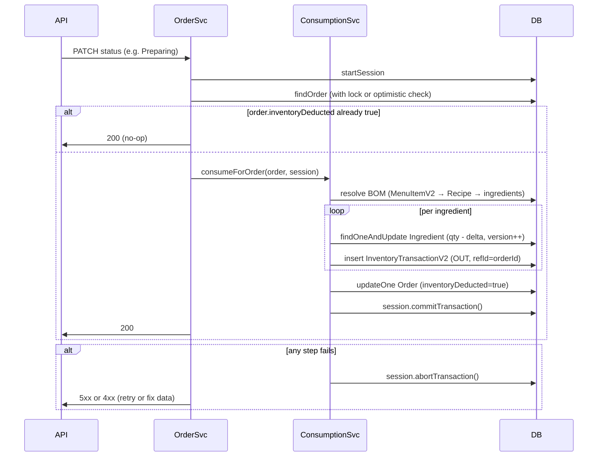

# Production MERN Inventory Consumption – Full Audit

Senior full-stack architect audit of Order → BOM → Inventory flow for a multi-tenant food ordering SaaS (MongoDB + Node.js + Express).

---

## 1. Data Flow Errors (Order → BOM → Inventory)

| Issue | Location | Finding |
|-------|----------|--------|
| **Order → MenuItemV2** | `orderConsumptionService.js` | Match is by **name** (5 strategies) or optional `menuItemId`/`costingMenuItemId` on order item. Name mismatch (cart menu vs Finances), encoding, or missing sync causes "Menu item not found" and **silent skip** (no transaction created). |
| **MenuItemV2 → RecipeV2** | Same | MenuItemV2.recipeId links to BOM. If `recipeId` is null, consumption is skipped; auto-link by name can fail. No validation at order-placement that item has a BOM. |
| **Recipe → Ingredient** | Same | Recipe.ingredients[].ingredientId must reference IngredientV2. Missing or wrong ref → "Ingredient not found" and **continue** (partial consumption, no rollback). |
| **cartId propagation** | Order, Transaction | Order.cartId (outlet) must be set; otherwise consumption exits early. Dine-in from table without table.cartId can leave order.cartId null. Transactions store cartId for tenant isolation; string vs ObjectId mismatch in queries can hide data. |

---

## 2. Missing Transactions / Race Conditions

| Issue | Finding |
|-------|--------|
| **Consumption not in a DB transaction** | No `session.startTransaction()` / `withTransaction()`. Multiple `ingredient.save()` and `InventoryTransactionV2.save()` are independent. One failure leaves **partial state** (some ingredients deducted, some not; order still marked `inventoryDeducted`). |
| **Order flag set before consumption** | `updateOrderStatus`: `inventoryDeducted: true` is written in the same `findByIdAndUpdate` as the status change. Consumption runs **after** in background (fire-and-forget). So the order is marked "deducted" before any stock is actually consumed. If consumption fails, **no retry** is triggered (all triggers check `!order.inventoryDeducted`). |
| **finalizeOrder** | Sets `inventoryDeducted = true` and `order.save()`, then awaits `consumeIngredientsForOrder`. If consumption fails, order remains with `inventoryDeducted = true` and is never retried. |

---

## 3. Incorrect Async Handling

| Issue | Location | Finding |
|-------|----------|--------|
| **Fire-and-forget** | `orderController.js` (updateOrderStatus, confirmPaymentByCustomer, markPaymentPaid) | `consumeIngredientsForOrder(...).then(...).catch(...)` is not awaited. HTTP response is sent before consumption completes. Failures only appear in logs; caller has no way to know or retry. |
| **Mixed await vs then** | finalizeOrder awaits consumption; updateOrderStatus does not | Inconsistent: finalize surfaces errors; status change and payment confirm do not. |
| **No retry** | All paths | If consumption fails (e.g. DB timeout, validation), there is no retry queue or job. Order stays with `inventoryDeducted = true` and missing/partial transactions. |

---

## 4. Quantity Mismatch Issues

| Issue | Finding |
|-------|--------|
| **scaleFactor** | `scaleFactor = itemQuantity / recipe.portions`. If `recipe.portions` is 0 (schema allows min: 1, but legacy/corrupt data could exist), division by zero. No guard. |
| **totalQtyToConsume** | `qtyPerPortion * scaleFactor` – recipe.qty can be 0; then 0 consumed (no error). No validation that recipe quantities are > 0. |
| **itemQuantity** | From `orderItem.quantity || 1`. If quantity is 0 or negative, 0 or 1 is used; no explicit validation. |
| **KOT vs order items** | Consumption iterates `order.kotLines[].items`. If frontend sends different structure or items are in another field, items can be missed. |

---

## 5. Unit Conversion Errors

| Issue | Location | Finding |
|-------|----------|--------|
| **convertToBaseUnit** | `ingredientModel.js`, `orderConsumptionService.js` | Uses conversionFactors Map; missing UOM adds 1:1 for same base or throws. Recipe can use UOM not in ingredient (e.g. "cup") → throw → caught → error pushed, **continue** to next ingredient (partial consumption). |
| **Floating point** | scaleFactor, totalQtyToConsume, qtyInBaseUnit | All plain Number. No rounding to a fixed precision before persist. Can cause tiny fractional qtyInBaseUnit and costAllocated; aggregation/sum can drift. |
| **Unit in transaction** | InventoryTransactionV2 stores `qty`, `uom`, `qtyInBaseUnit` | Stored values are whatever was computed; no re-validation or rounding before save. |

---

## 6. Multi-Tenant Isolation Bugs

| Issue | Finding |
|-------|--------|
| **cartId filter** | getInventoryTransactions uses `filter.cartId = req.user._id` for admin. Order consumption stores `cartId: cartIdObj`. If order.cartId is string in DB and filter is ObjectId (or vice versa), transactions can be invisible to the outlet. |
| **Shared ingredients** | WeightedAverageService: for shared ingredient (no cartId) with outlet cartId, stock is derived from transactions by cartId. If transactions have wrong or null cartId, availableQty/cost can be wrong. |
| **Recipe/Ingredient scope** | MenuItemV2/RecipeV2 queries use cartId/franchiseId. Strategy 5 uses shared items (no cartId); wrong tenant could get a match if names collide. |
| **Order without cartId** | Orders without cartId skip consumption; no fallback by table/franchise in the consumption service itself (only in createOrder/addKot). |

---

## 7. Schema / Relationship Problems

| Issue | Finding |
|-------|--------|
| **Order._id** | String (e.g. "ORD-20250211001"). refId in InventoryTransactionV2 is Mixed; stored as string. Queries by refId work; no schema ref to Order. |
| **Order item refs** | menuItemId / costingMenuItemId optional; many orders have only name. Reliable BOM path requires frontend to send costing menu item id. |
| **Recipe.portions** | Required min: 1; default 1. No check in consumption for portions > 0 before divide. |
| **Ingredient.qtyOnHand** | For shared ingredient with cartId, WeightedAverageService does **not** update qtyOnHand (stock from transactions only). So ingredient.qtyOnHand can be stale for that outlet. |

---

## 8. API Endpoint Flow Mistakes

| Flow | Mistake |
|------|--------|
| PATCH order status | Status + `inventoryDeducted: true` updated atomically; consumption runs async. Response 200 before consumption; client cannot know if deduction succeeded. |
| POST finalize | Sets flag, saves order, then awaits consumption. Failure is only logged; order still marked deducted. |
| confirmPaymentByCustomer / markPaymentPaid | Same fire-and-forget consumption; no way to return "inventory deduction failed" to client. |
| Cancel / Return | No endpoint calls inventory **return** or reversal. Order status becomes Cancelled/Returned but stock is never restored. |

---

## 9. Edge Cases (Cancel / Refund)

| Case | Current Behavior | Expected |
|------|------------------|----------|
| **Order Cancelled** (before or after Preparing) | No inventory reversal. If consumption already ran, stock stays deducted. | If consumption was done: create RETURN transactions (or compensating OUT reversals) and adjust stock. |
| **Order Returned** (after Paid) | No inventory return. Stock remains deducted. | Return ingredients for that order (lookup by refType/refId, create RETURN or reverse OUT). |
| **Partial item return** | Order can have some items returned (orderItem.returned). Consumption skips returned items only for **future** runs; already-created OUT transactions for those items are not reversed. | Either reverse only the returned items’ consumption or document that returns are financial-only. |

---

## 10. Double Deduction Bugs

| Mechanism | Finding |
|-----------|--------|
| **inventoryDeducted flag** | Set to true when status enters Preparing/Ready/Completed/Paid/Exit (or on finalize). Prevents re-entry in **same** flow. |
| **Idempotency** | Per-KOT: existing transactions with refType "order", refId order._id, notes "KOT:i" mark KOT i as processed. New KOTs are processed. So **same order can be processed multiple times** (e.g. status change to Preparing, then to Ready) and only new KOTs are consumed. If two requests run concurrently, both can read "no transactions for KOT 0" and both deduct → **double deduction**. |
| **No distributed lock** | No lock per order or per (order, KOT). Two status updates in parallel can double-consume. |

---

## 11. Failed Rollback Scenarios

| Scenario | Behavior |
|----------|----------|
| Consumption fails mid-loop (e.g. 3rd ingredient throws) | First two ingredients already saved (Ingredient + Transaction). No rollback of those two. Order still has inventoryDeducted = true. |
| WeightedAverageService.consume throws after ingredient.save() | Transaction document not yet created; ingredient already updated. Partial state with no OUT transaction. |
| Transaction.save() fails after consume() | Ingredient already updated; no transaction record. Stock and reporting inconsistent. |

---

## 12. Concurrency Issues

| Issue | Finding |
|-------|--------|
| **Read-modify-write** | WeightedAverageService: find ingredient, compute availableQty from transactions or qtyOnHand, subtract, save. Two concurrent consumes for same ingredient can both read same availableQty and both deduct → **over-consumption**. |
| **No optimistic locking** | Ingredient has no version field. Last write wins. |
| **Order status** | Two concurrent PATCHes (e.g. Preparing and Ready) can both pass `!order.inventoryDeducted`, both set true in update, both trigger consumption. Idempotency by KOT reduces but does not eliminate double work if KOTs overlap. |

---

## 13. Partial Failure States

| State | Cause |
|-------|--------|
| Order.inventoryDeducted = true, zero OUT transactions | Consumption ran but every item failed (e.g. no MenuItemV2, no recipe). Flag already set; no retry. |
| Order.inventoryDeducted = true, some OUT transactions | Some items/KOTs consumed; others failed (name not found, recipe missing). No rollback of successful ones. |
| Some ingredients updated, no transactions | consume() succeeded, transaction.save() failed or not reached. |
| Negative qtyOnHand | allowNegativeStock: true for order consumption; insufficient stock still deducts. Reporting and alerts can show negative. |

---

## 14. Incorrect Database Queries

| Issue | Finding |
|-------|--------|
| **cartId type** | Some paths pass cartId as string, others ObjectId. MongoDB matches type; string vs ObjectId can return no docs. toObjectIdSafe in controller helps; service sometimes uses cartId string in query. |
| **refId** | Order._id is string; stored in refId. find({ refType: "order", refId: order._id }) is correct. |
| **Existing transactions** | existingTransactions by refType + refId; no cartId in filter. Correct for idempotency. |

---

## 15. Wrong ID References

| Risk | Finding |
|------|--------|
| recipeIngredient.ingredientId | Must be IngredientV2._id. If recipe was created with wrong ref (e.g. old ingredient id), findById returns null and consumption skips with log. |
| menuItem.recipeId | Must be RecipeV2._id. Populated or not; same risk if wrong id. |
| order.cartId | Must be User (admin) _id for the outlet. Tables and createOrder set it; legacy or import can have invalid ref. |

---

## 16. Invalid Aggregation Logic

| Use | Finding |
|-----|--------|
| Food cost report | Aggregates InventoryTransactionV2 with type OUT/WASTE, sum(costAllocated), filter by cartId and date. If cartId is string in some docs and ObjectId in filter (or vice versa), those docs are excluded. |
| Stock from transactions | WeightedAverageService sums IN/RETURN and subtracts OUT/WASTE. Order of sort({ date: 1 }) is correct. If transactions are missing (wrong cartId) or duplicated, stock is wrong. |

---

## 17. Floating Point Quantity Errors

| Location | Risk |
|----------|------|
| scaleFactor = itemQuantity / recipe.portions | Can be irrational (e.g. 2/3). |
| totalQtyToConsume = qtyPerPortion * scaleFactor | Float. |
| qtyInBaseUnit from convertToBaseUnit | Float. |
| costAllocated = qtyToConsume * avgCost | Float. |

No rounding before persisting; repeated operations can accumulate error. No use of a decimal library or fixed-precision integers.

---

## 18. Missing Validation

| Missing | Where |
|---------|--------|
| recipe.portions > 0 | Before scaleFactor. |
| recipeIngredient.qty >= 0 | Before totalQtyToConsume. |
| order.cartId present and valid ObjectId | Early in consumption (done); no validation at order create. |
| Order status in allowed list before consumption | Trigger paths check status; consumption itself does not re-validate. |
| No duplicate (orderId, kotId) processing under concurrency | No lock or unique constraint. |

---

## 19. Missing Inventory Locking

| Gap | Impact |
|-----|--------|
| No per-ingredient lock | Concurrent consumes for same ingredient → over-deduction. |
| No per-order lock | Concurrent status updates → possible double consumption for same KOT. |
| No MongoDB transaction (session) | Partial updates on failure; no atomicity across Order + multiple Ingredient + multiple InventoryTransactionV2. |

---

## 20. Silent Failures Without Logs

| Case | Logging |
|------|--------|
| Order has no cartId | console.warn + return. |
| Menu item not found | console.warn, error in summary. |
| No recipe | console.warn, error in summary. |
| Ingredient not found | console.warn, continue. |
| Conversion error | console.error, error in summary or rethrow. |
| consume() or transaction.save() failure | Caught in item/ingredient loop; logged; summary.errors. |
| Fire-and-forget rejection | .catch() logs to console; no structured log or metric. |

Structured logging (request id, order id, user, duration, outcome) and metrics (success/failure count, latency) are not present. No alerting on consumption failure.

---

# Correct Architecture Flow (Target)



---

# Atomic Transaction Design (MongoDB)

- Use a **single MongoDB session** for: reading order (and optionally locking), all ingredient updates, all InventoryTransactionV2 inserts, and order.inventoryDeducted update.
- **Order of operations**: resolve BOM (read-only), then in transaction:
  1. For each (ingredient, qty): `Ingredient.findOneAndUpdate({ _id, version }, { $inc: { qtyOnHand: -qtyInBaseUnit, __v: 1 } }, { session })` (or equivalent with your schema).
  2. Insert all OUT transactions in one or more `insertMany` with `session`.
  3. `Order.updateOne({ _id }, { $set: { inventoryDeducted: true, inventoryDeductedAt: new Date() } }, { session })`.
- **Commit** once. On any failure, **abort** and do not set inventoryDeducted.
- **Idempotency**: at start of consumption, inside the same transaction, check for existing OUT transactions for this order (refType "order", refId order._id). If any exist, skip deduction and only set inventoryDeducted if not already set (or skip update). Optionally use a **deduplication key** (e.g. orderId + idempotencyKey) to prevent double submission from client.

---

# Safe Inventory Deduction Logic

1. **Resolve BOM** (read-only, outside or at start of transaction): Order → kotLines → items → MenuItemV2 (by id or name+cartId) → Recipe → ingredients. Validate portions > 0, all ingredientIds exist, conversion factors present.
2. **Compute all deltas** in memory: per ingredient, sum (qtyInBaseUnit) with fixed precision (e.g. round to 4 decimals or use integer in smallest unit). Validate no negative deltas.
3. **Optional stock check**: for each ingredient, availableQty (from current qtyOnHand or transaction sum) >= delta. If not and policy is "reject", abort before any write.
4. **In one transaction**:  
   - For each ingredient: atomic decrement (e.g. $inc) and optional version increment.  
   - Insert all OUT transactions.  
   - Set order.inventoryDeducted = true.  
5. **Rounding**: store qtyInBaseUnit and costAllocated rounded (e.g. 4 decimals) to avoid float drift.
6. **No fire-and-forget**: await consumption in the request that changes status (or finalize). Return error to client if consumption fails so they can retry or fix data.

---

# Recovery Strategy

1. **Detection**: Periodic job or admin report: orders with `inventoryDeducted === true` and no InventoryTransactionV2 with refType "order" and refId = order._id. Flag for retry or manual fix.
2. **Retry**: Endpoint or job: for such orders, clear `inventoryDeducted` (or set to false) and re-trigger consumption (with idempotency so already-processed KOTs are skipped). Prefer running consumption in a transaction as above.
3. **Cancel/Return**: On order Cancelled (before or after Preparing) or Returned:  
   - Find all OUT transactions for refType "order", refId = order._id.  
   - For each, create RETURN transaction (or compensating IN) and adjust ingredient qty (or run returnToInventory in a transaction).  
   - Then update order (e.g. status, payment).
4. **Reconciliation**: Nightly or weekly: for each outlet, sum OUT (order) vs sum of order totals (from orders). Alert on large mismatch.

---

# Logging Plan

- **Structured logs** (JSON): requestId, orderId, cartId, userId, action (e.g. "consumption_start", "consumption_success", "consumption_fail"), durationMs, errorCode, message, itemsProcessed, ingredientsConsumed.
- **Log at**: consumption start, consumption end (success/partial/fail), and for each failed item/ingredient (reason).
- **Do not** log PII in payloads; log only ids and counts.

---

# Monitoring Plan

- **Metrics**:  
  - consumption_requests_total (labels: outcome=success|partial|fail)  
  - consumption_duration_seconds (histogram)  
  - consumption_orders_with_zero_transactions (gauge or counter)  
  - inventory_deduction_errors_total (by error type)
- **Alerts**:  
  - consumption failure rate > threshold  
  - orders with inventoryDeducted but no OUT transactions (batch check)  
  - negative qtyOnHand for any ingredient
- **Dashboard**: Success rate by outlet, latency p99, count of partial/full failures per day.

---

# Production-Safe Implementation (High Level)

- Use **one MongoDB session** per consumption run; run all writes (ingredient updates, transaction inserts, order update) in **withTransaction**.
- **Set inventoryDeducted only after** successful commit (inside the same transaction as the OUT transactions).
- **Await** consumption in the API handler that changes status (or finalize); return 503 or 409 on failure and **do not** set inventoryDeducted so that retry can run.
- **Idempotency**: at start, in same transaction, check existing OUT for this order; if full consumption already present, skip and return success.
- **Lock or version**: use findOneAndUpdate with version (__v) or a dedicated version field on Ingredient to avoid concurrent over-deduction.
- **Rounding**: round qtyInBaseUnit and costAllocated to fixed decimals before save.
- **Cancel/Return**: implement inventory return (RETURN transactions + ingredient adjustment) when order is Cancelled or Returned, in a transaction.
- **Structured logging + metrics** as above; alert on failures and reconciliation gaps.

---

# Step-by-Step: Order Placed → BOM Resolved → Stock Deducted → Order Confirmed

1. **Order placed**: Order created with kotLines[].items (name, quantity, optional menuItemId/costingMenuItemId). cartId and franchiseId set (from table or request). inventoryDeducted = false.
2. **Order confirmed (status → Preparing or similar)**:  
   - API receives PATCH with status.  
   - Load order; if inventoryDeducted already true, respond 200 and skip.  
   - Start MongoDB session.  
   - **Resolve BOM**: For each KOT and each item (skip returned): resolve MenuItemV2 (by id or name+cartId), then Recipe; validate portions > 0 and recipe.ingredients present. Compute per-ingredient qtyInBaseUnit (scaleFactor = itemQty/portions, then convert to base unit); round. Build list of (ingredientId, qtyInBaseUnit, costAllocated).  
   - **Deduct**: For each (ingredientId, qty): Ingredient.findOneAndUpdate with $inc and session; insert OUT transaction with refType "order", refId = order._id, session.  
   - Order.updateOne({ _id }, { $set: { inventoryDeducted: true, inventoryDeductedAt } }, { session }).  
   - session.commitTransaction().  
   - Respond 200.
3. **If any step fails**: session.abortTransaction(); do not set inventoryDeducted; return 5xx/4xx; client or job can retry.
4. **Cancel/Return**: When status becomes Cancelled or Returned, in a new transaction: find OUT transactions for this order; for each create RETURN (or IN) and adjust ingredient; then update order status.

---

# Pseudocode: Correct Implementation

```text
async function consumeIngredientsForOrder(order, userId) {
  if (!order.cartId) return { success: false, reason: 'NO_CART_ID' };
  if (order.inventoryDeducted) return { success: true, alreadyProcessed: true };

  const session = await mongoose.startSession();
  session.startTransaction();
  try {
    // 1) Idempotency: already consumed for this order?
    const existing = await InventoryTransactionV2.countDocuments(
      { refType: 'order', refId: order._id },
      { session }
    );
    if (existing > 0) {
      await Order.updateOne(
        { _id: order._id },
        { $set: { inventoryDeducted: true, inventoryDeductedAt: new Date() } },
        { session }
      );
      await session.commitTransaction();
      return { success: true, alreadyProcessed: true };
    }

    // 2) Resolve BOM (read-only)
    const deductions = []; // { ingredientId, qtyInBaseUnit, costAllocated, uom, qty }
    for (const kot of order.kotLines || []) {
      for (const item of kot.items || []) {
        if (item.returned) continue;
        const menuItem = await resolveMenuItemV2(order.cartId, item);
        if (!menuItem?.recipeId) continue;
        const recipe = await RecipeV2.findById(menuItem.recipeId).lean();
        if (!recipe?.portions || !recipe.ingredients?.length) continue;
        const scale = (item.quantity || 1) / recipe.portions;
        for (const ri of recipe.ingredients) {
          const qty = round((ri.qty * scale), 4);
          const qtyBase = convertToBaseUnit(ri.ingredientId, qty, ri.uom);
          const cost = getCost(ri.ingredientId, order.cartId, qtyBase);
          deductions.push({ ingredientId: ri.ingredientId, qtyInBaseUnit: qtyBase, costAllocated: cost, uom: ri.uom, qty });
        }
      }
    }

    // 3) Aggregate by ingredient
    const byIng = new Map();
    for (const d of deductions) {
      const k = d.ingredientId.toString();
      if (!byIng.has(k)) byIng.set(k, { ...d });
      else {
        const t = byIng.get(k);
        t.qtyInBaseUnit += d.qtyInBaseUnit;
        t.costAllocated += d.costAllocated;
      }
    }

    // 4) Atomic deduct + transactions
    const txDocs = [];
    for (const [ingId, agg] of byIng) {
      const res = await Ingredient.findOneAndUpdate(
        { _id: agg.ingredientId },
        { $inc: { qtyOnHand: -round(agg.qtyInBaseUnit, 4) } },
        { session, new: true }
      );
      if (!res) throw new Error('Ingredient not found: ' + agg.ingredientId);
      txDocs.push({
        ingredientId: agg.ingredientId,
        type: 'OUT',
        qty: agg.qty,
        uom: agg.uom,
        qtyInBaseUnit: round(agg.qtyInBaseUnit, 4),
        refType: 'order',
        refId: order._id,
        date: new Date(),
        costAllocated: round(agg.costAllocated, 2),
        recordedBy: userId,
        cartId: order.cartId,
        notes: 'order',
      });
    }
    await InventoryTransactionV2.insertMany(txDocs, { session });
    await Order.updateOne(
      { _id: order._id },
      { $set: { inventoryDeducted: true, inventoryDeductedAt: new Date() } },
      { session }
    );
    await session.commitTransaction();
    return { success: true };
  } catch (e) {
    await session.abortTransaction();
    throw e;
  } finally {
    session.endSession();
  }
}
```

- `resolveMenuItemV2(cartId, item)`: your existing Strategy 1–5 lookup; return MenuItemV2 doc or null.
- `convertToBaseUnit(ingredientId, qty, uom)`: load ingredient, call convertToBaseUnit, round.
- `getCost(ingredientId, cartId, qtyBase)`: your existing last-purchase or weighted-avg logic; return number.
- `round(x, d)`: e.g. `Math.round(x * 10**d) / 10**d`.

This keeps **one transaction** for all ingredient updates, all OUT inserts, and the order flag, and only sets inventoryDeducted after commit, with idempotency and no fire-and-forget.
